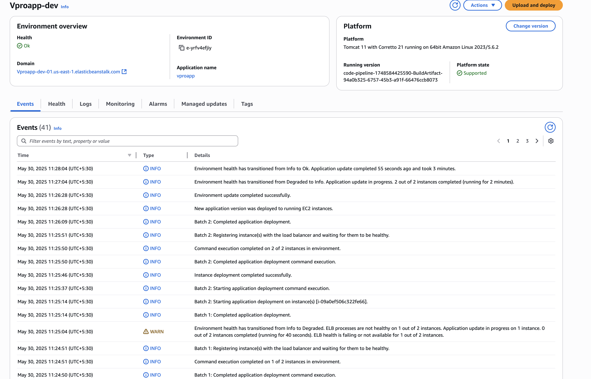
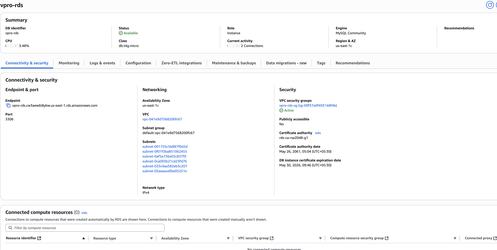
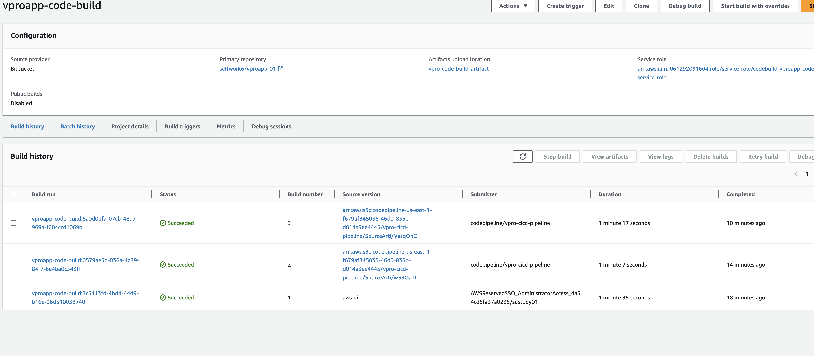
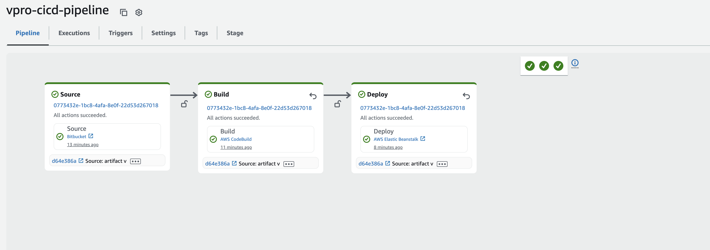
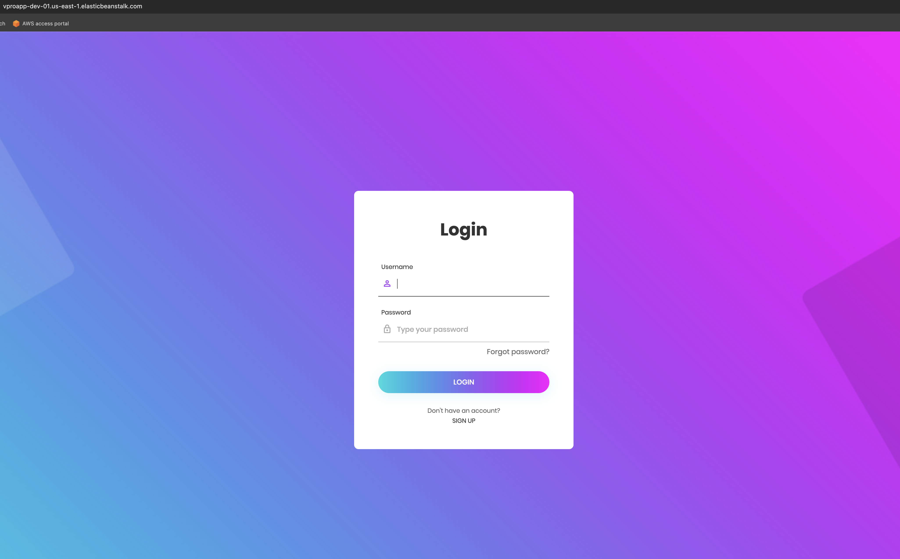

# CI/CD Pipeline: Bitbucket to AWS Elastic Beanstalk (with RDS)

## 🏗️ Architecture Overview

```
Bitbucket (Source Code)
     |
     v
AWS CodePipeline
  ├── Source Stage: Bitbucket
  ├── Build Stage: AWS CodeBuild
  └── Deploy Stage: Elastic Beanstalk (connected to RDS)
```

## ✅ Step-by-Step Setup Guide

### Step 1: Create Elastic Beanstalk Environment

1. Open the **Elastic Beanstalk** console.
2. Click **Create Application**.
3. Choose your **platform** (tomcat).
4. Configure environment:

   - Environment type: **Web server**
   - Choose instance type, scaling options

5. Save the **environment name** (vpro-dev-01).



### Step 2: Create Amazon RDS

1. Go to **RDS Console** → Create database.
2. Engine: MySQL/PostgreSQL
3. Configure DB identifier, username, password
4. Place RDS in the same **VPC/Subnet group** as Beanstalk
5. Update **RDS Security Group**:

   - Allow inbound MySQL (3306) access from Beanstalk instance SG

6. Add DB connection info to Beanstalk **Environment Variables**



### Step 3: Migrate Source Code to Bitbucket

1. Clone GitHub repo:

```bash
git clone https://github.com/yourusername/yourrepo.git
cd yourrepo
```

2. Create new Bitbucket repo
3. Change remote:

```bash
git remote set-url origin https://bitbucket.org/yourteam/yourrepo.git
git push -u origin main
```

### Step 4: Create CodeBuild Project

1. Open **AWS CodeBuild** → Create build project
2. Source: Bitbucket via **CodeStar Connections**
3. Environment: Managed image (Ubuntu + Java/Node)
4. Add `buildspec.yml` file in repo root:

5. Artifacts:

   - Type: **Amazon S3**
   - Specify or create a bucket



### Step 5: Create CodePipeline

1. Go to **AWS CodePipeline** → Create pipeline
2. Source stage:

   - Provider: **Bitbucket** (via CodeStar)

3. Build stage:

   - Provider: **AWS CodeBuild** → Select project

4. Deploy stage:

   - Provider: **Elastic Beanstalk**
   - App: Select your Beanstalk app
   - Environment: `vpro-dev-01`



### Step 6: Test CI/CD with Git Commit

```bash
git add .
git commit -m "Test CI/CD flow"
git push origin main
```

- Visit CodePipeline → Watch execution through all stages
- Confirm updated app on Elastic Beanstalk



---

## 🙌 Author

**Mohanasundram Sumangaly**  
Cloud Engineer | DevOps Enthusiast

---
