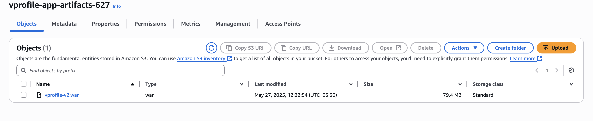

# 🚀 AWS Lift-and-Shift Deployment: Web Application

This project demonstrates a full **Lift-and-Shift migration** of the Java-based `vProfile` application onto AWS. It replicates a traditional 3-tier architecture using native AWS services for scalability, reliability, and high availability.

---

## 📆 Application Stack

- **Frontend / App Layer**: Apache Tomcat 10
- **Backend Services**:

  - MySQL (Database)
  - RabbitMQ (Messaging)
  - Memcached (Cache)

- **Artifact Storage**: S3
- **Load Balancer**: ALB with HTTP/HTTPS
- **DNS**: Custom domain via GoDaddy (`vprofileapp.sdstudy.xyz`)
- **Auto Scaling**: Launch Template + ASG from AMI

---

## 📊 Architecture Overview

```text
                ┌────────────────────────────┐
                │    GoDaddy DNS     │
                │ vprofileapp.sdstudy.xyz │
                └────────────────────────┘
                         │
                ┌───────────────────────┐
                │     AWS ALB      │
                │  HTTP / HTTPS    │
                └─────────────────────┘
                         │
                 ┌───────────────┐
                 │ Auto Scaling  │
                 │  (Tomcat AMI) │
                 └───────────────┘
                         │
          ┌─────────────────────────────────┐
          │  Private Hosted Zone (R53)  │
          └─────────────────────────────────┘
                │        │        │
     ┌────────┐ ┌───────┐ ┌───────────┐
     │  MySQL DB │ │ RabbitMQ │ │ Memcached │
     └────────┘ └───────┘ └───────────┘
```

---

## ✅ Setup Steps

### 1. EC2 + Security

- Created SGs for ALB, App, and Backend with appropriate port rules
- Launched EC2s for Tomcat, MySQL, RabbitMQ, Memcached using user data

### 2. User Data Bootstrapping

- Each EC2 installs and configures services automatically on boot
- Tomcat instance runs Java 17 and Tomcat 10

### 3. S3 + IAM

- S3 Bucket: `vprofile-app-artifacts-627`
- Built `.war` via Maven and uploaded to S3
- IAM role `s3-admin` created and attached to EC2 with S3 access

### 4. Route 53 Private DNS

- Private Hosted Zone: `vprofile.in`
- A-records:

  - `db01.vprofile.in` → MySQL private IP
  - `rmq01.vprofile.in` → RabbitMQ private IP
  - `mc01.vprofile.in` → Memcached private IP

### 5. ALB + Public DNS

- ALB forwards HTTP (80) to Tomcat via Target Group
- Custom Domain: `vprofileapp.sdstudy.xyz` (GoDaddy)
- CNAME record pointing to ALB DNS

### 6. Auto Scaling

- Created AMI from Tomcat instance
- Launch Template based on AMI
- ASG with min=1, max=2, registered with ALB Target Group

---

## 📃 Screenshots

### EC2 Instances


### S3 Artifact Upload



### IAM Role and Instance Profile


### ALB and Target Group


### GoDaddy DNS Mapping


### Route 53 Private Zone


### Auto Scaling Group + Launch Template


### Final Application UI


---

## 🔧 Tools & Services Used

- Amazon EC2
- Amazon S3
- Amazon Route 53 (Private)
- Application Load Balancer
- Auto Scaling Group
- IAM Roles & Policies
- Apache Tomcat, MySQL, RabbitMQ, Memcached
- GoDaddy (Public DNS)
- Maven (Build Tool)

---

## 📄 Deployment Highlights

- Fully automated EC2 provisioning using user data
- Internal DNS resolution via Route 53 Private Zones
- Artifact deployment via S3
- Scalable app layer using AMI-based ASG
- Public domain routing through GoDaddy DNS

---

## 🧑‍💻 Author

**Mohanasundram Sumangaly**
Cloud Engineer | DevOps Enthusiast

---
