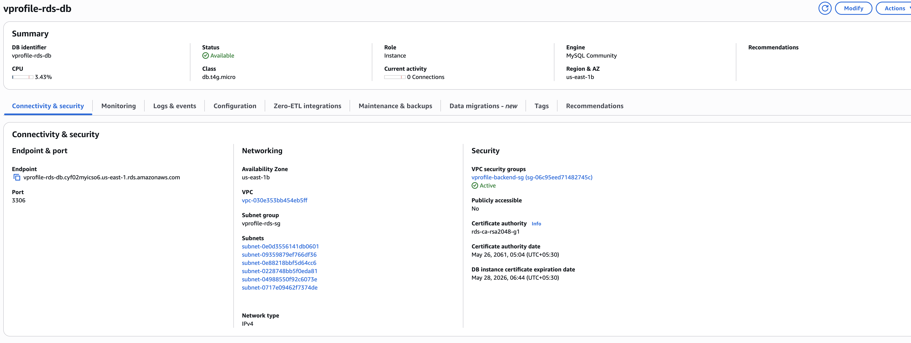
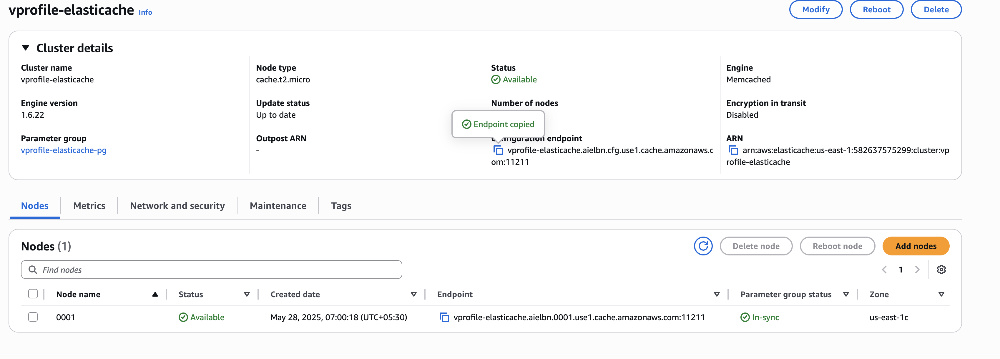
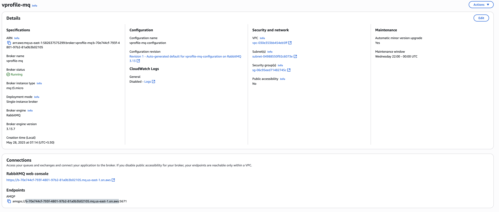
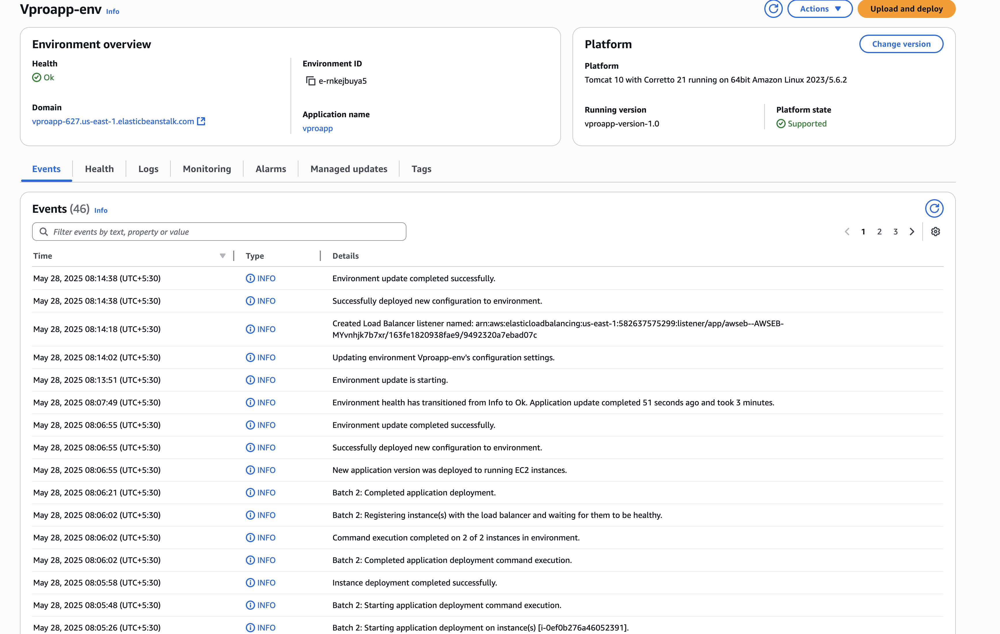
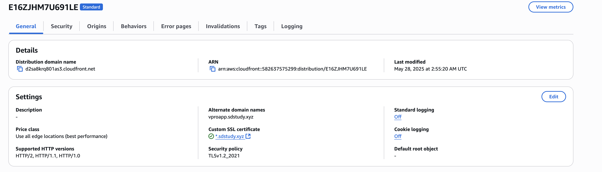
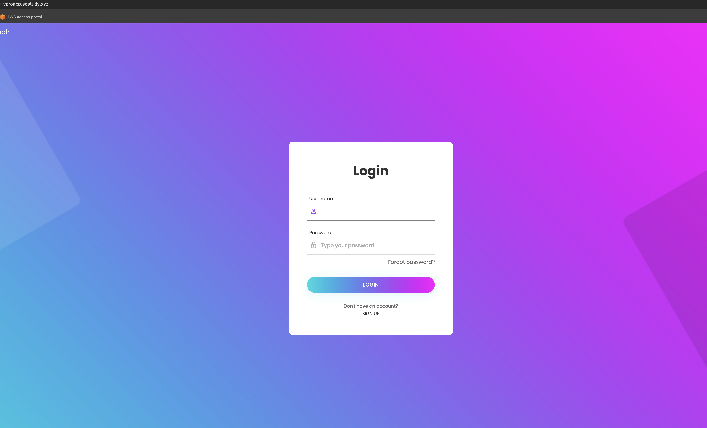

# 🌐 Full-Stack Java Web Application on AWS (Elastic Beanstalk, RDS, MQ, ElastiCache)

This project showcases the deployment of a production-ready Java web application on AWS using **PaaS (Elastic Beanstalk)** and **SaaS (RDS, Amazon MQ, ElastiCache)**, secured with a custom domain and HTTPS via CloudFront and GoDaddy.

---

## 📌 Architecture Overview

- **Frontend Access**: Users access the app via CloudFront using a custom GoDaddy domain (`https://vproapp.sdstudy.xyz/`)
- **Application Layer**: Deployed on **Elastic Beanstalk (Tomcat)** with autoscaling and load balancing
- **Backend Services**:

  - **RDS (MySQL)** for persistent database
  - **Amazon MQ (RabbitMQ)** for asynchronous messaging
  - **ElastiCache (Memcached)** for session caching

- **Monitoring**: AWS CloudWatch integrated for logs and metrics

---

## 🧱 Infrastructure Stack

| Component        | Service/Tool                    |
| ---------------- | ------------------------------- |
| Compute          | Elastic Beanstalk (Tomcat)      |
| Load Balancer    | Application Load Balancer (ALB) |
| CDN + HTTPS      | Amazon CloudFront + GoDaddy     |
| Database         | Amazon RDS (MySQL)              |
| Caching          | ElastiCache (Memcached)         |
| Messaging        | Amazon MQ (RabbitMQ)            |
| Artifact Storage | Amazon S3                       |
| Monitoring       | CloudWatch Logs and Alarms      |
| Security         | IAM, Security Groups, SSL (ACM) |

---

## 🚀 Deployment Flow

1. **Provision Backend Services**

   - Created and secured RDS, RabbitMQ, and Memcached with a shared backend SG
   - 
   - 
   - 

2. **Initialize DB**

   - Spun up temporary EC2 in the same VPC to run SQL init scripts

3. **Deploy WAR to Beanstalk**

   - WAR file uploaded and deployed directly from local
   - Beanstalk configured with custom EC2 instance profile & service role
   - 

4. **Configure Domain & HTTPS**

   - Added CloudFront in front of ALB
   - Requested ACM certificate and configured GoDaddy DNS
   - 
   - 

5. **Security & Monitoring**

   - Used SGs to isolate traffic; enabled CloudWatch for logging

6. **Final App Access**
   - 

---

## 🔐 Security

- **Security Groups** used for network-level control
- **ACM SSL Cert** for HTTPS with CloudFront
- **IAM Roles** for fine-grained access (EC2, Beanstalk)

---

## 🏋️️ Tech Stack

- Java, Spring Boot
- MySQL (RDS)
- RabbitMQ (Amazon MQ)
- Memcached (ElastiCache)
- AWS Elastic Beanstalk
- CloudFront, Route 53 / GoDaddy
- S3, IAM, CloudWatch

---

## 🙌 Author

**Mohanasundram Sumangaly**  
Cloud Engineer | DevOps Enthusiast

---
