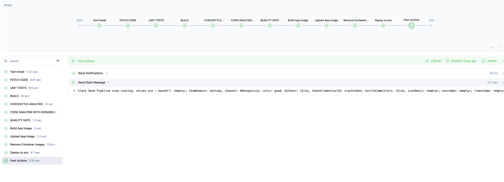
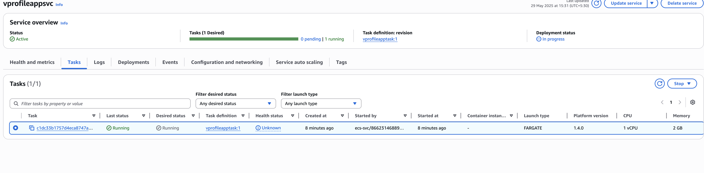
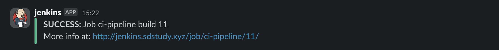

# 🚀 Java Web App – CI/CD with Jenkins, Docker, ECR, and ECS

This portfolio project demonstrates a complete CI/CD pipeline using Jenkins for building, testing, analyzing, containerizing, and deploying a Java-based web application to Amazon ECS via Docker and Amazon ECR.

---

## 🧱 Architecture Overview

```
Developer → GitHub → Jenkins →
   ├─ Run Unit Tests (Maven)
   ├─ Code Style Check (Checkstyle)
   ├─ Static Code Analysis (SonarQube)
   ├─ Quality Gate Enforcement
   ├─ Build WAR (Maven)
   ├─ Build Docker Image (Multistage Dockerfile)
   ├─ Push to Amazon ECR
   ├─ Deploy to Amazon ECS (Fargate)
   └─ Notify via Slack
```

---

## 🔧 Technologies Used

- **Jenkins** (Pipeline-as-Code, Docker plugin, Slack plugin)
- **Java 17**, **Maven 3.9**
- **SonarQube 6.2**
- **Checkstyle**
- **Docker (Multistage builds)**
- **Amazon ECR** (Elastic Container Registry)
- **Amazon ECS** (Elastic Container Service - Fargate)
- **AWS CLI**
- **Slack Notifications**

---

## ⚙️ Jenkins Pipeline Features

- ✅ **SCM Checkout** from GitHub `docker` branch
- ✅ **Maven Unit Testing**
- ✅ **Checkstyle Report Generation**
- ✅ **SonarQube Code Analysis & Quality Gate**
- ✅ **WAR Packaging**
- ✅ **Docker Image Build using Multistage Dockerfile**
- ✅ **Push to Amazon ECR**
- ✅ **Deploy to Amazon ECS**
- ✅ **Slack Notification on Every Build**

---

## 📦 Prerequisites

### Jenkins EC2 Server

- Docker Engine installed
- AWS CLI installed
- Jenkins user added to Docker group
- Required Jenkins Plugins:

  - Pipeline
  - Docker Pipeline
  - AWS Steps
  - Slack Notification
  - SonarQube Scanner
  - Credentials Binding

### AWS Resources

- IAM User or Role with:

  - `AmazonECS_FullAccess`
  - `AmazonEC2ContainerRegistryFullAccess`

- Amazon ECR Repository: `vprofile/appimg`
- Amazon ECS Cluster: `vprofile`
- ECS Service: `vprofileappsvc` (with Fargate)

---

## 🔐 Jenkins Credentials

- **awscreds**: AWS Access Key ID & Secret
- **sonarserver**: SonarQube host token
- **Slack token** for `slackSend` (set via Jenkins Credentials)

---

## 🚀 Running the Pipeline

1. Push code to `docker` branch in GitHub.
2. Jenkins pipeline gets triggered.
3. Pipeline performs:

   - Testing → Analysis → WAR build
   - Docker image build and push to ECR
   - ECS service update with new image
   - Slack notification

---

## 📸 Screenshots

### Jenkins Pipeline Execution



### SonarQube Code Quality Report


### Docker Image Pushed to ECR


### ECS Task Deployment Confirmation



### Slack Build Notification



---

## 📚 References

- [Jenkins Pipeline Documentation](https://www.jenkins.io/doc/book/pipeline/)
- [Amazon ECR Docs](https://docs.aws.amazon.com/AmazonECR/latest/userguide/what-is-ecr.html)
- [Amazon ECS Docs](https://docs.aws.amazon.com/ecs/)
- [SonarQube](https://www.sonarqube.org/)

---

## 👨‍💼 Author

**Mohanasundram Sumangaly**
Cloud Engineer | DevOps Enthusiast

---
