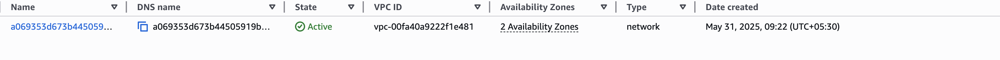
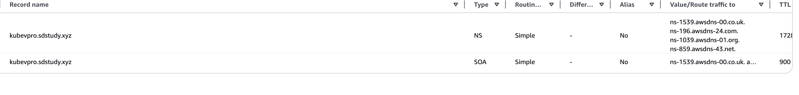
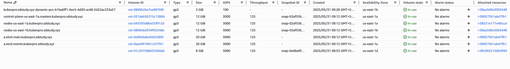
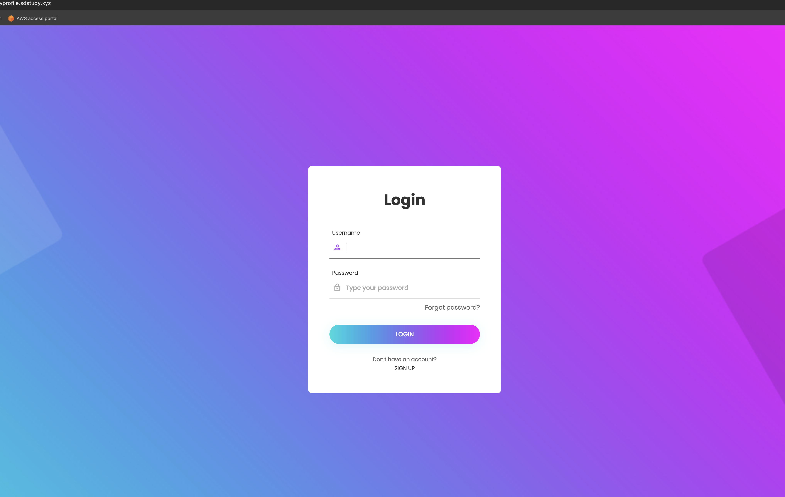
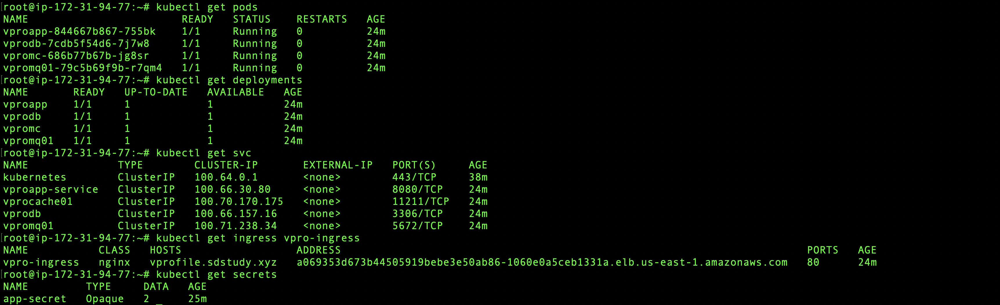

# Kubernetes-Based App Deployment (Tomcat + DB + RMQ + Memcached)

This project demonstrates deploying a Java Tomcat-based web application on a Kubernetes cluster using ALB, Ingress, and backend services (MySQL DB, RabbitMQ, Memcached) with persistent storage (EBS).

---

## 📌 Architecture Overview

```
Client Request
     ↓
[Application Load Balancer (ALB)]
     ↓
[Ingress Controller (nginx / alb-ingress-controller)]
     ↓
[Tomcat Kubernetes Service (ClusterIP/NodePort)]
     ↓
[Tomcat Pod (App)]
     ↓
 ┌────────────┬───────────────┬────────────┐
 │            │               │            │
 ▼            ▼               ▼            ▼
RMQ Service  Memcached SVC   DB Service   Secrets (via envFrom or volumeMount)
 ▼            ▼               ▼            ▼
RMQ Pod     Memcached Pod    DB Pod       Secrets for DB & RMQ
                                │
                                ▼
                         [PVC -> StorageClass -> EBS]
```

---

## 🚀 Steps to Deploy

### 1. Kubernetes Cluster Setup

- Provision a cluster using kops
- Configure `kubectl`
- Install Ingress Controller (NGINX or ALB Ingress)

```bash
kubectl apply -f https://raw.githubusercontent.com/kubernetes/ingress-nginx/controller-v1.9.4/deploy/static/provider/cloud/deploy.yaml
```



---

### 2. Apply Kubernetes Definitions

#### 📁 PVC for DB

```bash
kubectl apply -f dbpvc.yaml
```

#### 🔐 Secret for DB Password

Create `app-secret.yaml` if not already defined:

```yaml
apiVersion: v1
kind: Secret
metadata:
  name: app-secret
type: Opaque
stringData:
  db-pass: rootpass
```

```bash
kubectl apply -f app-secret.yaml
```

#### 🐘 MySQL DB

```bash
kubectl apply -f dbdeploy.yaml
kubectl apply -f dbservice.yaml
```

#### ⚡ Memcached

```bash
kubectl apply -f mcdep.yaml
kubectl apply -f mcservice.yaml
```

#### 🧩 Tomcat App

```bash
kubectl apply -f appdeploy.yaml
kubectl apply -f appservice.yaml
```

#### 🌐 Ingress Resource

```bash
kubectl apply -f appingress.yaml
```





---

## 🔍 Access the App

- Update your DNS to point `vprofile.sdstudy.xyz` to ALB
- Or fetch the Ingress IP:

```bash
kubectl get ingress
```



---

## ✅ Validation

```bash
kubectl get all
kubectl describe ingress vpro-ingress
kubectl logs -f deployment/vproapp
```



---

## 🙌 Author

**Mohanasundram Sumangaly**  
Cloud Engineer | DevOps Enthusiast

---
