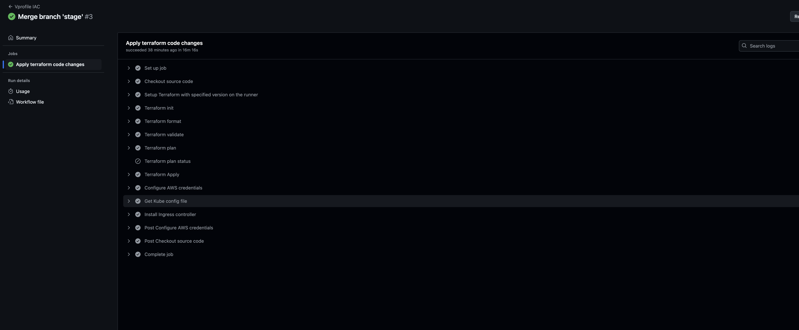
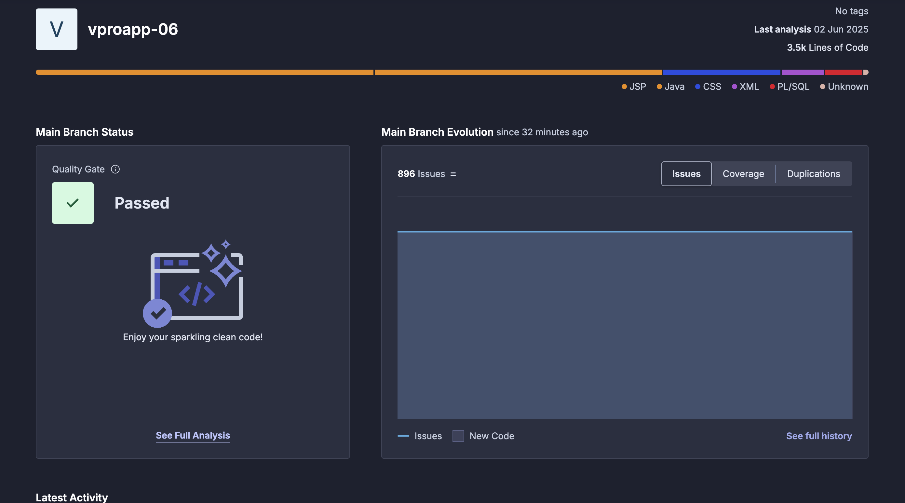
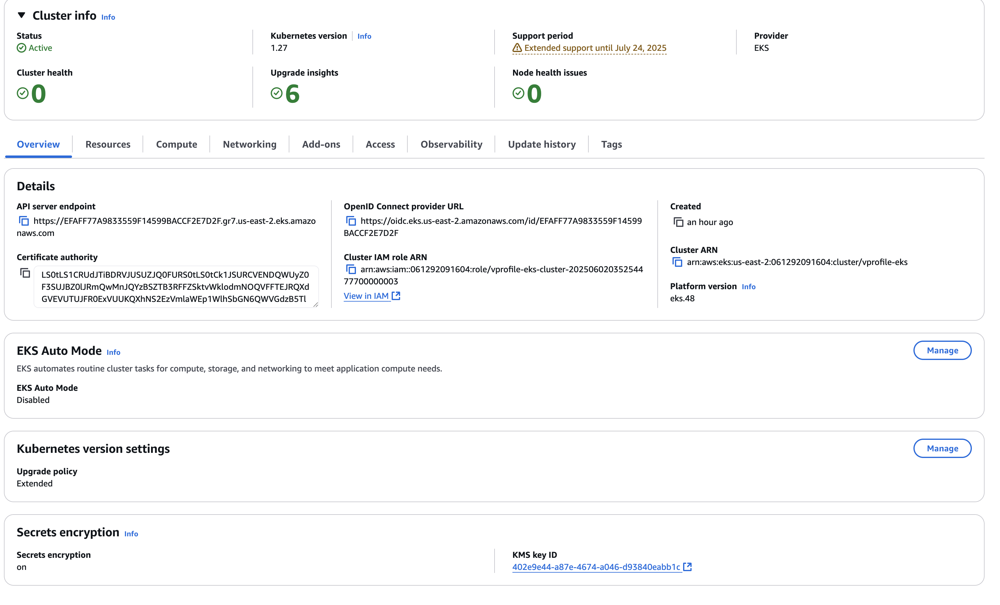
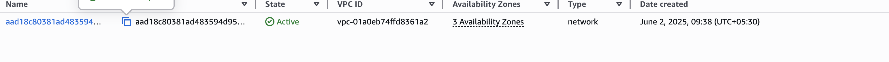
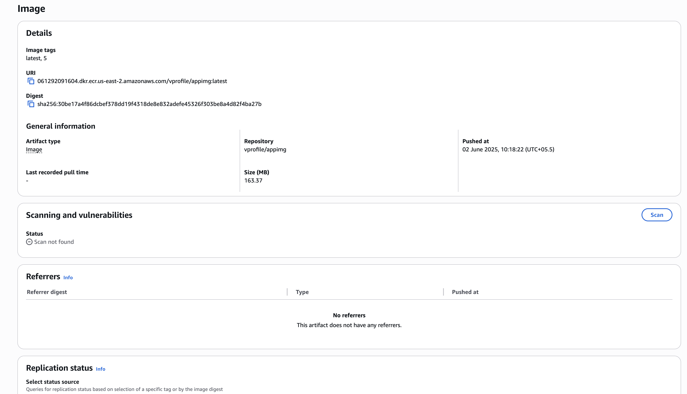
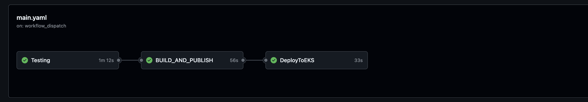

# 📘 GitOps CI/CD on AWS EKS with Terraform & Helm

This project demonstrates a GitOps workflow using GitHub Actions to automate infrastructure provisioning and application deployment to AWS EKS using Terraform and Helm.

---

## 🧭 Architecture Overview

```
VSCode Push ➝ GitHub Repository
     ├── Terraform Workflow
     │    ├── Push to stage ➝ terraform plan
     │    ├── PR to main ➝ terraform apply ➝ EKS infrastructure
     │
     └── App Workflow
          ├── Maven build & test
          ├── SonarCloud scan
          ├── Docker build & push ➝ ECR
          └── Deploy to EKS ➝ Helm charts
```

---

## 🔐 GitHub Secrets to Configure

| Secret Name             | Description                                                               |
| ----------------------- | ------------------------------------------------------------------------- |
| `AWS_ACCESS_KEY_ID`     | AWS access key                                                            |
| `AWS_SECRET_ACCESS_KEY` | AWS secret key                                                            |
| `BUCKET_TF_STATE`       | S3 bucket for Terraform state                                             |
| `SONAR_URL`             | URL for SonarCloud (e.g., [https://sonarcloud.io](https://sonarcloud.io)) |
| `SONAR_TOKEN`           | Token for authenticating to SonarCloud                                    |
| `SONAR_ORGANIZATION`    | Your SonarCloud organization name                                         |
| `SONAR_PROJECT_KEY`     | Unique project key for SonarCloud project                                 |
| `REGISTRY`              | ECR registry URL (e.g., xxxxx.dkr.ecr...)                                 |

---

## ⚙️ Step-by-Step Setup

### 1. Prepare GitHub Repo

- Create repo and push your source code, Dockerfile, Terraform, and Helm files.
- Place GitHub Actions workflows in `.github/workflows/`.

### 2. Configure Secrets

- Add all the required secrets from the table above in repo settings ➝ Actions ➝ Secrets.

### 3. Terraform Workflow (`terraform.yml`)

- Triggered on push to `main` or `stage` within `terraform/`
- Executes `terraform init`, `fmt`, `validate`, `plan`, and `apply`
- Updates kubeconfig and installs ingress controller



### 4. Application Workflow (`main.yaml`)

- Triggered manually (`workflow_dispatch`)
- Runs:

  - Maven build & checkstyle
  - SonarCloud code scan
  - Docker build & push to ECR
  - Deploys using Helm to EKS







### 5. Testing

- Push infrastructure changes to `stage` ➝ create PR to `main` ➝ merge ➝ triggers `terraform.yml`
- Trigger `main.yaml` manually or modify to auto-run on `push`
- Confirm app is live in EKS via `kubectl` or dashboard

---

## ✅ Tools Used

- **GitHub Actions** – CI/CD automation
- **Terraform** – EKS infrastructure provisioning
- **SonarCloud** – Code quality analysis
- **Docker + ECR** – Container build and registry
- **Helm** – Kubernetes deployment manager
- **EKS** – AWS-managed Kubernetes

---

## 🙌 Author

**Mohanasundram Sumangaly**  
Cloud Engineer | DevOps Enthusiast

---
